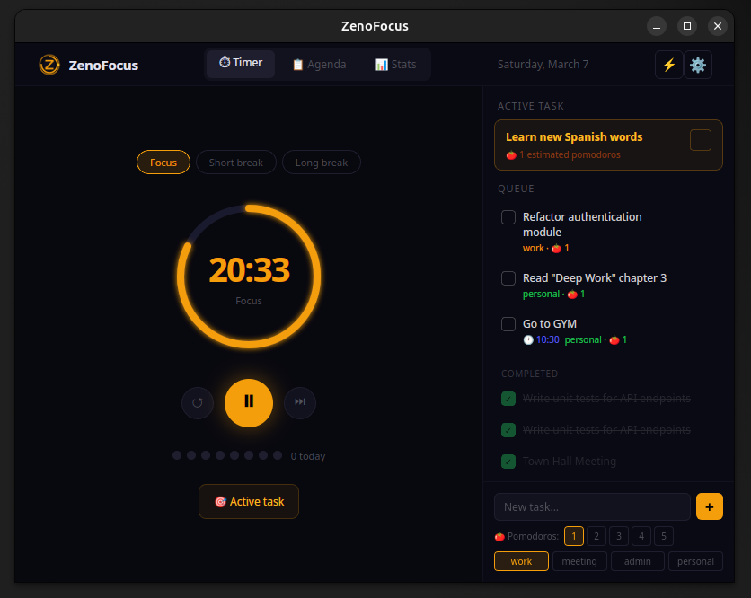
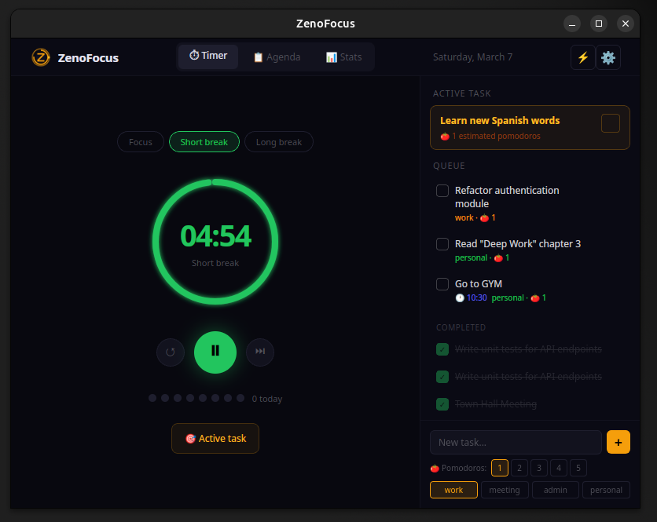
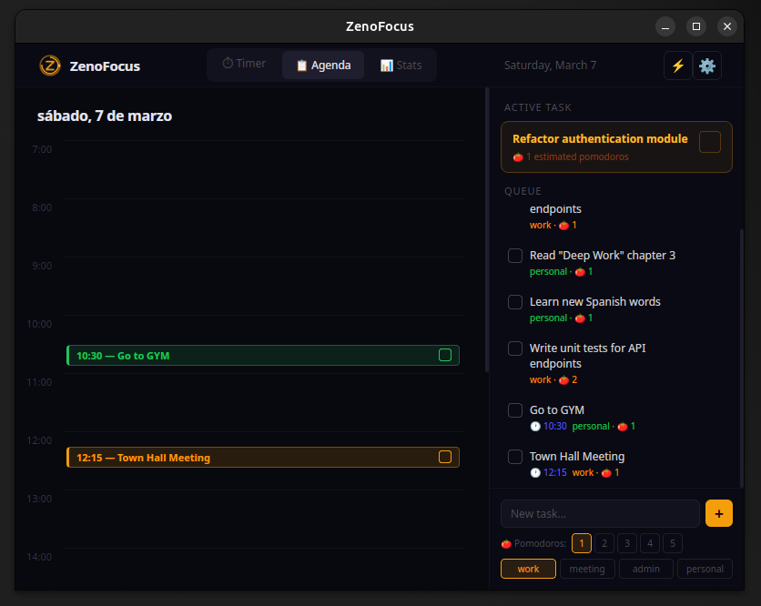
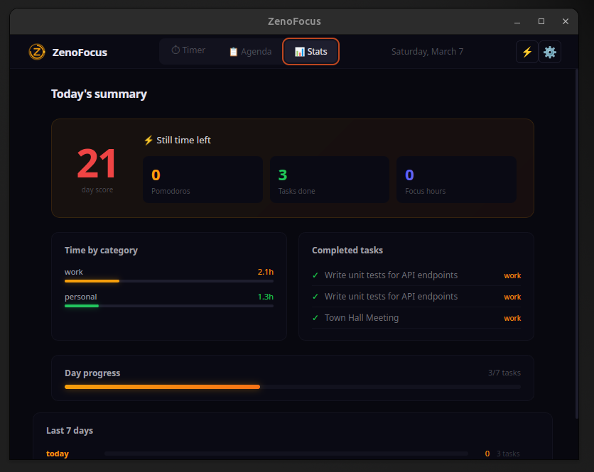
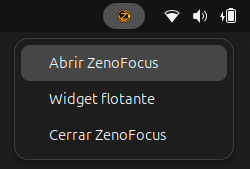
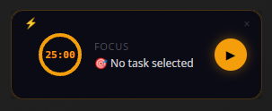

# ⚡ ZenoFocus

**A minimal, native Pomodoro timer for Linux — built with Tauri + React**

[](https://github.com/daniacosta-dev/zenofocus/actions)
[](LICENSE)
[](https://github.com/daniacosta-dev/zenofocus/releases)
[](https://github.com/daniacosta-dev/zenofocus/releases)

<div align="center">






</div>


[🇬🇧 English](#english) · [🇪🇸 Español](#español)

</div>

---

### Table of Contents
- [Features](#features)
- [Installation](#installation)
- [Usage](#usage)
- [Tech Stack](#tech-stack)
- [Contributing](#contributing)
- [Donate](#donate)
- [License](#license)

### Features

- **⏱ Pomodoro Timer** — Focus, short break, and long break modes with visual progress ring
- **📋 Task Management** — Create, edit, delete, and prioritize your daily tasks
- **📅 Agenda** — Visual timeline from 7am to 8pm with scheduled tasks and automatic reminders
- **📊 Stats** — Daily score, weekly history, and time breakdown by category
- **🪟 Floating Widget** — Always-on-top mini timer you can drag anywhere on screen
- **🔔 System Notifications** — Native GNOME notifications when sessions end
- **🖥 Tray Icon** — Quick access from your system tray
- **⚙️ Configurable** — Standard (25/5/15) or custom durations, autostart, sound
- **🌍 Bilingual** — Full Spanish and English support
- **💾 Persistent** — All tasks and settings saved to disk automatically

### Installation

#### Option 1 — .deb package (Ubuntu, Debian, Pop!_OS, Mint)

```bash
wget https://github.com/daniacosta-dev/zenofocus/releases/latest/download/zenofocus_amd64.deb
sudo dpkg -i zenofocus_amd64.deb
```

#### Option 2 — AppImage (any distro)

```bash
wget https://github.com/daniacosta-dev/zenofocus/releases/latest/download/zenofocus_amd64.AppImage
chmod +x zenofocus_amd64.AppImage
./zenofocus_amd64.AppImage
```
> **Note:** The AppImage version requires `xdotool` to be installed for the widget's "open main window" button to work when the app is minimized: `sudo apt install xdotool`. The `.deb` package installs it automatically.
> **Note for GNOME users:** For the tray icon to appear, install the [AppIndicator extension](https://extensions.gnome.org/extension/615/appindicator-support/).

### Usage

1. **Add tasks** to your sidebar before starting
2. **Select a task** to set it as active
3. **Start the timer** — 25 minutes of focused work
4. **Take a break** when the session ends
5. **Repeat** — every 4 pomodoros take a long break
6. **Check Stats** to review your day

The floating **widget** can be opened from the tray icon menu and dragged anywhere on your screen.

### Tech Stack

| Layer | Technology |
|---|---|
| Frontend | React + TypeScript |
| Desktop | Tauri v2 (Rust) |
| State | Zustand |
| Persistence | tauri-plugin-store |
| Notifications | notify-send (via Rust) |
| Build | Vite |

### Contributing

Contributions are welcome! Here's how to get started:

```bash
# Clone the repo
git clone https://github.com/daniacosta-dev/zenofocus.git
cd zenofocus

# Install dependencies
npm install

# Install Rust (if needed)
curl --proto '=https' --tlsv1.2 -sSf https://sh.rustup.rs | sh

# Install Linux system dependencies
sudo apt install -y libwebkit2gtk-4.1-dev libappindicator3-dev librsvg2-dev patchelf

# Run in development mode
npm run tauri dev
```

Please open an issue before submitting a large PR. Bug fixes and translations are always appreciated.

### Donate

If ZenoFocus helps you stay productive, consider supporting its development:

[](https://ko-fi.com/daniacostadev)
